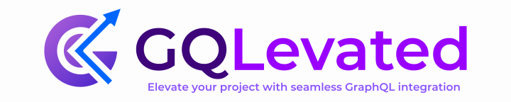
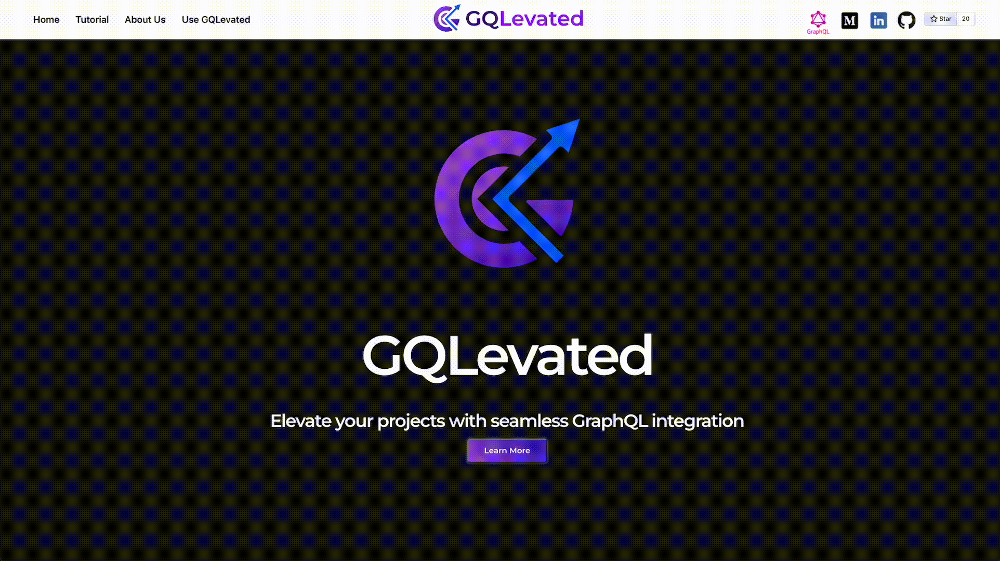

<!--
*** This ReadMe document was insipred by the ReadMe template from
*** https://github.com/othneildrew/Best-README-Template
-->

<!--
*** https://www.markdownguide.org/basic-syntax/#reference-style-links
-->

<!-- GQLevated -->
<div id="top" align="center">

<br/>
<!-- PROJECT SHIELDS -->

[![Contributors][contributors-shield]][contributors-url]
[![Stargazers][stars-shield]][stars-url]
[![Forks][forks-shield]][forks-url]
[![Issues][issues-shield]][issues-url]
[![MIT License][license-shield]][license-url]

</div>


<!-- TABLE OF CONTENTS -->
<details open="open">
  <summary>Table of Contents</summary>
  <ol>
      <li><a href="#about-gqlevated">About GQLEvated</a></li> 
      <li><a href="#background">Background</a></li>
      <li><a href="#lets-get-started">Getting Started</a></li>      
      <li><a href="#how-does-it-work">How Does It Work</a></li>
         <ul>
            <li><a href="#connect-to-your-database">Connect To Your Database</a></li>      
            <li><a href="#generate-your-graphql-code">Generate Your GraphQL Code</a></li>     
            <li><a href="#export-your-graphql-code">Export Code</a></li>     
            <li><a href="#Visualize-your-GraphQL-schema">Visualize Your Code</a></li>     
            </ul>
      <li><a href="#developers">Developers</a></li>
         <ul>
            <li><a href="#built-with">Built With</a></li>     
            <li><a href="#project-setup">Project Setup</a></li> 
         </ul>
    <li><a href="#contributors">Contributors</a></li>
    <li><a href="#license">License</a></li>
  </ol>
</details>

</br>


<!-- ABOUT -->
## About GQLevated

[GQLevated](https://GQLevated.dev) is an open source GraphQL prototyping tool. Our Web Hosted Development Tool supplies users with customized, production-ready GraphQL code including server-side Types, Root Queries and Mutations as well as client-side Queries and Mutations. This allows developers to spend more time solving problems and less time tediously writing GraphQL code, thus ELEVATING the project as a whole. Here is a [medium]() article describing the inspiration behind GQLevated.

And it’s free to use for everyone - no need to create an account!

Accelerated by <a href="https://github.com/oslabs-beta/" >OS Labs</a>.

</br>

 <!-- BACKGROUND -->

## Background

GraphQL is a query language for APIs and can be an ideal method over RESTful architecture for fulfilling queries of your existing data with less API calls. GraphQL provides a complete and understandable description of the data in your API, gives clients the power to ask for exactly what they need and nothing more, makes it easier to evolve APIs over time, and enables powerful developer tools.

However, making the switch to GraphQL on a project that utilizes relational databases and RESTful API is very time consuming and labor intensive due to its redundant structure, requiring a large amount of code to be written.

</br>

 <!-- Lets Get Started -->
## Let's Get Started

Visit <a class="nav-link" href="https://GQLevated.dev/">https://GQLevated.dev</a> to launch our web hosted tool.

- Click the Learn More Button on our landing page to learn what GQLevated can do.
- Click the Use GQLevated to start using our tool.
- Go to the [Developer's](#developers) section for instructions on how to contribute.

<p align="right">(<a href="#top">back to top</a>)</p>

 <!-- HOW DOES IT WORK -->
## How Does It Work?
</br>

<!-- CONNECT DB -->
### Connect to your database

Enter your PostgreSQL or MongoDB connection string and connect to your database.
Don’t have a connection string but still want to see how it works? No problem! 
Connect to our PostgresQL Sample Database and see GQLevated in action.
<div  align="center">

</div>

<p align="right">(<a href="#top">back to top</a>)</p>

<!-- GENERATE CODE -->

### Generate your GraphQL code

With one simple click of a button GQLevated connects to your database, parses the data and generates the corresponding GraphQL code for you. This production-ready GraphQL code includes server-side Types, Root Queries and Mutations as well as client-side Queries and Mutations. It is displayed for you in an easy to reason about way and ready to be injected into your own application.


<div  align="center">

</div>

<p align="right">(<a href="#top">back to top</a>)</p>

<!-- EXPORT CODE -->
### Export your GraphQL code

In addition to copying and pasting the newly generated GraphQL code straight from the browser display, users also have the option to export their customized GraphQL code as individual JavaScript files. Simply click on the ‘Export Code‘ button in the corresponding container of the code that you wish to download.


<p align="right">(<a href="#top">back to top</a>)</p>

<!-- VISUALIZE -->
## Visualize your databases

After generating their GraphQL Code, users will have the option to visualize and interact with their PostgreSQL or MongoDB databases!


<br />
<br />


<p align="right">(<a href="#top">back to top</a>)</p>

## Developers

This section describes the instructions for developers who would like to download and contribute to the open-source GQLevated project.
### Built With

The GQLevated application was built using the following frameworks/libraries:

- [Next.js](https://nextjs.org/)
- [React](https://reactjs.org/)
- [Redux Toolkit](https://redux-toolkit.js.org/)
- [Typescript](https://www.typescriptlang.org/)
- [GraphQL](https://graphql.org/)
- [Apollo](https://www.apollographql.com/)
- [NodeJS](https://nodejs.org/en/)
- [Express](https://expressjs.com/)
- [MongoDB](https://www.mongodb.com/)
- [Mongoose](https://mongoosejs.com/)
- [PostgreSQL](https://postgresql.org/)
- [ReactFlow](https://reactflow.dev/)
- [NextUI](https://nextui.org/)
- [FramerMotion](https://www.framer.com/motion/)
- [ReactSyntaxHighlighter](https://www.npmjs.com/package/react-syntax-highlighter)
- [Jest](https://jestjs.io/)
- [Supertest](https://www.npmjs.com/package/supertest)
- [Crypto.js](https://cryptojs.gitbook.io/docs/)

<p align="right">(<a href="#top">back to top</a>)</p>

### Project Setup

Required software for setting up this application:

- [NodeJS](https://nodejs.org/en/)
- [NPM ](https://www.npmjs.com/)

1. Clone the repo.
   ```sh
   git clone https://github.com/oslabs-beta/GQLevated.git
   cd GQLevated
   ```
2. Install the package dependencies.
   ```sh
   npm install
   ```
3. The application can be run in development mode by running the following command and going to http://localhost:3000/ on your browser.

   ```sh
   npm run dev
   ```

<p align="right">(<a href="#top">back to top</a>)</p>

<!-- CONTRIBUTORS -->

## Contributors

[John Alicastro](https://www.linkedin.com/in/johnalicastro) [@JohnAlicastro](https://github.com/JohnAlicastro)

[Johnson Che](https://www.linkedin.com/in/JohnsonChe/) [@JohnsonChe](https://github.com/JohnsonChe)

[Nicholas Gonzalez](https://www.linkedin.com/in/nicholasagonzalez/) [@Nikootz](https://github.com/Nikootz)

[Quyen Calixto](https://www.linkedin.com/in/quyencalixto/) [@QtieCoder](https://github.com/QtieCoder)


<p align="right">(<a href="#top">back to top</a>)</p>

If you have a suggestion that would make this better, please fork the repo and create a pull request. You can also simply open an issue with the tag "enhancement".
Don't forget to give the project a star! Thanks again!

1. Fork the Project
2. Create your Feature Branch (`git checkout -b feature/AmazingFeature`)
3. Commit your Changes (`git commit -m 'Add some AmazingFeature'`)
4. Push to the Branch (`git push origin feature/AmazingFeature`)
5. Open a Pull Request

<p align="right">(<a href="#top">back to top</a>)</p>

## License

This project is licensed under the MIT License - see the [LICENSE.md](https://github.com/oslabs-beta/GQLevated/blob/main/LICENSE) file for details.

<!-- MARKDOWN LINKS & IMAGES -->
<!-- https://www.markdownguide.org/basic-syntax/#reference-style-links -->

[contributors-shield]: https://img.shields.io/github/contributors/oslabs-beta/GQLevated.svg?style=for-the-badge
[contributors-url]: https://github.com/oslabs-beta/GQLevated/graphs/contributors
[stars-shield]: https://img.shields.io/github/stars/oslabs-beta/GQLevated.svg?style=for-the-badge
[stars-url]: https://github.com/oslabs-beta/GQLevated/stargazers
[forks-shield]: https://img.shields.io/github/forks/oslabs-beta/GQLevated.svg?style=for-the-badge
[forks-url]: https://github.com/oslabs-beta/GQLevated/network/members
[issues-shield]: https://img.shields.io/github/issues/oslabs-beta/GQLevated.svg?style=for-the-badge
[issues-url]: https://github.com/oslabs-beta/GQLevated/issues
[license-shield]: https://img.shields.io/github/license/oslabs-beta/GQLevated.svg?style=for-the-badge
[license-url]: https://github.com/oslabs-beta/GQLevated/blob/master/LICENSE.txt
[linkedin-shield]: https://img.shields.io/badge/-LinkedIn-black.svg?style=for-the-badge&logo=linkedin&colorB=555
[linkedin-url]: https://www.linkedin.com/company/gqlevated